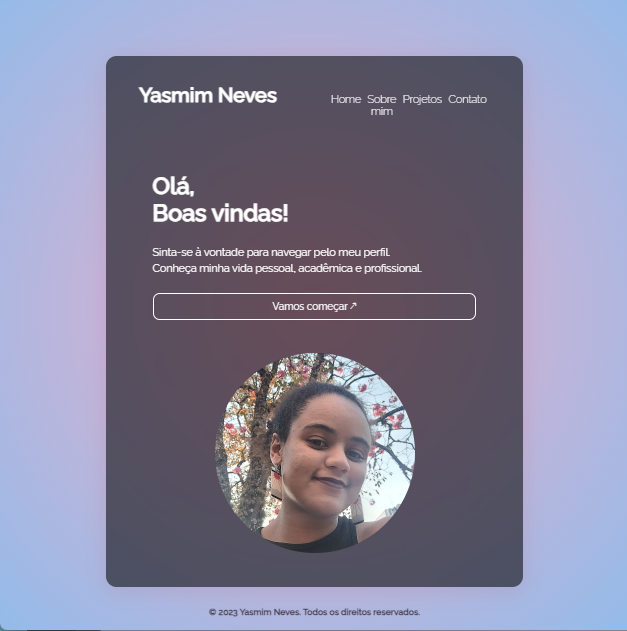

# curriculo-css
IFSUL de Minas -
Curso Técnico de Informática para Internet

Disciplina: Programação Web

Prof.: Wagner Josué

Avaliação CURRICULO CSS, dez/2023

Observações: o projeto foi feito em HTML e CSS.

